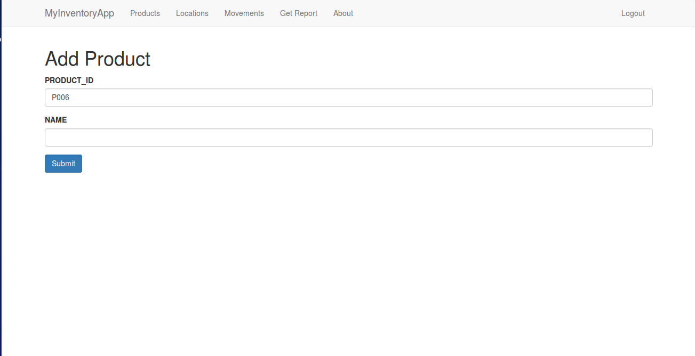

# MyInventoryApp
This is Inventory application build on python flask framework

### Login Page:

### Add/View/Edit Location Page:

### Add/Edit/View Product Page:

### Movement View Page:

### ReportPage:

### Add Product Page:

